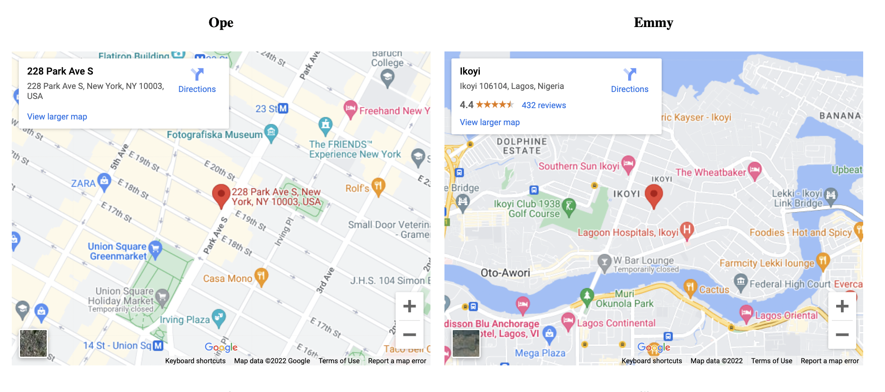

# combine the maps
This is a group project that requires group members to insert two or more google maps on thier webpage and arrange the maps so that they are placed side-by-side.

## Hints  
  1. Run the code to see the current webpage
  2. Put your current location on [google map](https://www.maps.google.com) and get the HTML embed.
  3. Insert indidvidual maps on different section. A sample placeholder where you can put the map has ben provided in the starter code
  4. the display of the overall container (`
`) for all the maps should be `flex` and set the flex property `flex-wrap` to `wrap`.
  5. Each map should have a heading of each members name. the heading should be centralized. This means a group with 4 members should have four maps on their webpage
  6. `<iframe>` should have a margin of `10px` on all sides (top, right, bottom, left).
  7. At the end, your group webpage should look like the one below

